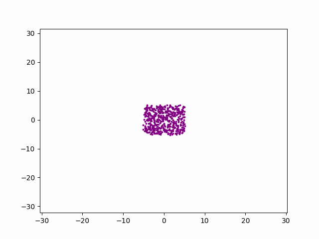
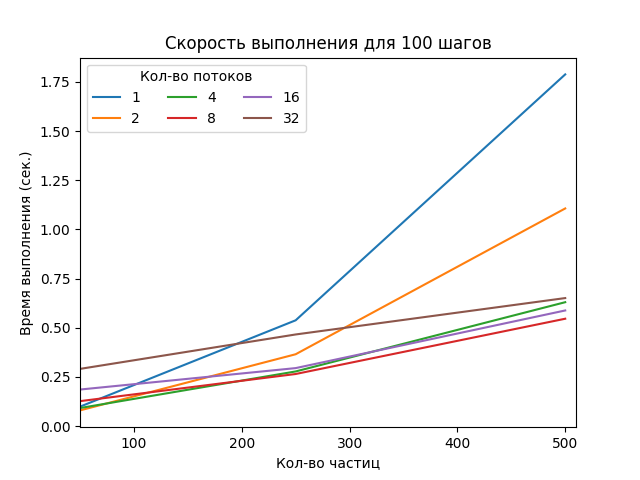

# Лабораторная работа №1 | Симуляция движения небесных тел

## Инструкция по использованию

### Сборка и запуск
Сбока:
```ps
gcc -g -pthread -o nProblem nProblem.c -lm
```
Запуск:
```ps
.\nProblem input_filename output_filename thread_count
```
input_filename - входные данные

output_filename - файл, в который необходимо выгрузить результат

thread_count - количество потоков

Пример:

```ps
.\nProblem ./input_data/input_222_100.txt ./output_data/output_222_100.csv 3
```
### Визуализация
[createGif.py](createGif.py)

Для создания gif изображения необходимо запустить следующую команду:
```ps
python createGif.py result_data gif_name
```
result_output_data - результаты работы программы [nProblem.c](nProblem.c)

gif_name - файл, в который необходимо выгрузить результат

Пример:

```ps
python createGif.py ./output_data/output_500_100.csv ./visualization/visual.gif
```
Результаты на разных данных:

На основе файла [output_data/output_500_100.csv](output_500_100.csv)



На основе файла [output_data/output_222_100.csv](output_222_100.csv)


### Генерация тестовых данных
Для полноценного тестирования был подготовлен скрипт [generate.py](generate.py), который формирует файлы входных данных на основе заданных условий

Запуск:
```ps
python generate.py bodies_count steps output_filename
```
bodies_count - количество необходимых небесных тел

steps - число шагов

output_filename - файл, в который необходимо выгрузить результат

Пример:
```ps
python generate.py 222 100 ./input_data/input_222_100.txt
```
Также, возможен ввод дополнительнох параметров:
```
minMass - минимальная масса тел

maxMass - максимальная масса тел

minXPos - минимальная позиция тела по оси Х

maxXPos - максимальная позиция тела по оси Х

minYPos - минимальная позиция тела по оси Y

maxYPos - максимальная позиция тела по оси Y

minXSpeed - минимальная скоростная проекция на ось X для тела

maxXSpeed - максимальная скоростная проекция на ось X для тела

minYSpeed - минимальная скоростная проекция на ось Y для тела

maxYSpeed - максимальная скоростная проекция на ось Y для тела
```

Пример с дополнительными параметрами:
```ps
python generate.py 222 100 ./input_data/input_222_100.txt -minXPos -20 -maxXPos 30
```
### Исследование производительности
Для анализа был подготовлен скрипт [analyse.py](analyse.py), который запускает скрипт генерации данных для каждого количества тел на 100 шагов и на основе созданных входных данных фиксирует время выполнения программы [nProblem.c](nProblem.c) с различным количеством потоков.

Запуск:
```ps
python analyse.py
```
В результате формируются графики со статистикой времени выполнения, а более подробные данные выводятся в консоль.
```ps
gcc (GCC) 13.2.0
AMD Ryzen 5 3500U with Radeon Vega Mobile Gfx     2.10 GHz
```
 

 

| Кол-во потоков\ тел |   50   |   250   |   500    |  1000   |   5000   |   1000   |
| ------------------- | ------ | ------- | -------- | ------- | -------- | -------- |
|         1           | 0.102s |  0.535s |  1.802s  | 6.025s  | 132.041s | 541.945s |
|         2           | 0.081s |  0.379s |  1.142s  | 3.761s  | 75.411s  | 320.744s |
|         4           | 0.088s |  0.253s |  0.708s  | 2.561s  | 47.383s  | 212.085s |
|         8           | 0.132s |  0.252s |  0.689s  | 1.661s  | 31.249s  | 151.599s |
|         16          | 0.203s |  0.277s |  0.626s  | 1.813s  | 33.349s  | 153.372s |
|         32          | 0.307s |  0.412s |  0.710s  | 1.741s  | 37.241s  | 153.888s |
